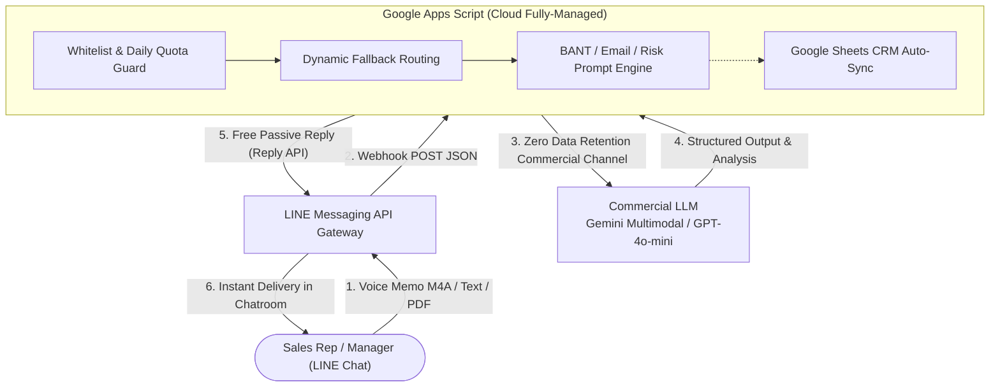

# 💼 Enterprise LINE AI Sales Assistant
### Enterprise LINE AI Sales Assistant (Serverless Sales Copilot)

🌐 **[繁體中文 (Traditional Chinese)](./README.md)** | **English (英文)**

 

<!-- Core Tech Stack & Quality Badges -->

 

<!-- Quick Navigation Bar -->
[ 🎯 Value Proposition ](#-1-value-proposition-why-line) •
[ 🚀 Production Scenarios ](#-2-four-core-production-scenarios) •
[ 💰 Cost Engineering ](#-3-pay-as-you-go-cost-engineering) •
[ 🛠️ Architecture ](#️-4-system-architecture) •
[ 🔒 Security & Privacy ](#-5-enterprise-security--commercial-privacy) •
[ ⚡ Quick Start ](#-6-5-minute-quick-start)

---

## 🎯 1. Value Proposition: Why LINE?

Traditional enterprise CRMs often suffer from low adoption because "opening a laptop, logging into a web portal, and navigating complex interfaces" introduces high operational friction.  
This project is purpose-built for **B2B field sales and sales support teams** with three core pillars: **No Web UI to Build, Zero Learning Curve, and Zero Infrastructure Maintenance**:

1. 📱 **Zero Learning Curve**: Direct interaction inside the everyday LINE messaging app—no new apps to install or web portals to remember.
2. ⚡ **Ultimate Field Convenience**: After a client meeting, in a taxi, or at a red light, simply press and record a 30-second voice memo. The AI formats reports and drafts emails instantly.
3. 🛠️ **Serverless Zero Overhead**: Powered by Google Apps Script serverless architecture—$0 server rent, zero database maintenance, permanently reliable.

---

## 🚀 2. Four Core Production Scenarios

### 1. ✉️ Full-Scenario Business Email & Negotiation Drafting
Input brief bullet points, and AI generates professional, tactful email/message drafts within 2 seconds (one-click copy ready):
* **Post-Meeting Thank You**: Confirms meeting takeaways, evaluation scope, and delivery milestones.
* **Discount Defense & Price Negotiation**: Employs the "Hold Price Line + Courteous Apology + Offer Extended Warranty/Value-Added Services" strategy.
* **Delivery Schedule & Supply Chain Delay**: Proactively explains current status, activates priority channels, and commits to specific delivery dates.

### 2. 🎙️ 30-Second Voice Memo to Structured BANT Report
Sales reps record a 30-second voice note in LINE right after a meeting (supports mixed Mandarin/English business terminology):
> 🗣️ **Sales Voice Memo**:  
> *"Visited Procurement Manager Mr. Wang at Company X this afternoon. They want to upgrade store systems with an estimated budget of $1.5M, targeting final sign-off before Q4. Current pain point is frequent crashes with their legacy system. Competing vendor is also quoting. Scheduled a technical demo with our engineer next Wednesday at 2 PM."*

🤖 **AI Structured Output within 2 Seconds**:
* 💰 **Budget**: NT$ 1,500,000
* 👤 **Authority**: Procurement Manager Mr. Wang (Action: explore technical Key Decision Makers)
* 🎯 **Need**: High crash rate on legacy system; requires seamless replacement before Q4
* ⏳ **Timeline**: Tech Demo next Wed 14:00 / Final decision before Q4
* ⚔️ **Competition & Strategy**: Competing vendor quoting; emphasize high system uptime and local real-time tech support
* 🚀 **Next Actions**: Coordinate engineer to prepare demo environment before next Wednesday

### 3. 📄 Instant PDF Contract & Spec Sheet Risk Review
Forward 20–50 page PDF contracts, NDAs, or specification documents directly into the LINE chat. The AI extracts:
* 🎯 **Scope & Deliverables**: 3 key bullets highlighting acceptance criteria.
* ⚠️ **Commercial Traps & Liability Risks**: Flags late-delivery penalties, performance bonds, and uncapped indemnification clauses.
* 💡 **Recommended Counter-Clauses**: Provides redline recommendations to protect company interests.

### 4. 📊 Automatic Synchronization to Google Sheets CRM
Every voice/text report is automatically logged to a Google Sheets CRM dashboard in the background, updating management in real time with zero manual data entry!

---

## 💰 3. Pay-As-You-Go Cost Engineering

Replaces expensive SaaS CRM monthly subscriptions with a transparent **Pay-As-You-Go** model:

| Evaluation Dimension | Traditional SaaS CRM / Outsourced Web | This Solution (Serverless AI Copilot) |
| :--- | :--- | :--- |
| 💰 **Hosting & Software License** | $100 ~ $500 / month | **$0 / month** (Google Apps Script fully-managed serverless) |
| 🤖 **AI Compute Cost** | Bundled in expensive tiers | **Pay-As-You-Go** (~$0.001 per call, approx. $0.5 ~ $1.0 / user / month) |
| 🔒 **Data Privacy SLA** | Shared multi-tenant public cloud | **100% Client-Owned Isolation** (Zero Data Retention SLA) |
| 🛡️ **Budget Hard Cap** | Manual invoice monitoring | **Daily Quota Circuit Breaker + Cloud Hard Budget Cap** |

---

## 🛠️ 4. System Architecture

---

## 🔒 5. Enterprise Security & Commercial Privacy

1. **Zero Data Retention (ZDR) Guarantee**:
   * Utilizes enterprise-tier Google Cloud / OpenAI commercial APIs with official contractual guarantees: **"Customer data submitted via commercial APIs is never used to train or improve models."**
2. **Stateless Processing (Zero-Log Architecture)**:
   * Conversions execute transiently in memory and are discarded immediately upon response. No plaintext conversation logs are retained on intermediate servers.
3. **Client-Owned Infrastructure**:
   * Deployed directly within the client's own Google Workspace and LINE Developers accounts, ensuring physical isolation after handover.
4. **Whitelist Access Control**:
   * Enforces LINE User ID whitelist filtering to prevent unauthorized access.

---

## ⚡ 6. 5-Minute Quick Start

Get up and running in 4 simple steps with zero server provisioning:

1. **Create Google Sheet**: Create a new spreadsheet in Google Drive, click **Extensions ➔ Apps Script**.
2. **Paste Code**: Copy the contents of [`gas/Code.gs`](./gas/Code.gs) into the editor.
3. **Set API Keys**: Configure `LINE_CHANNEL_ACCESS_TOKEN` and `GEMINI_API_KEY` in **Project Settings ➔ Script Properties**.
4. **Deploy Web App**: Click **Deploy ➔ New Deployment ➔ Web App**, and copy the Webhook URL into the LINE Developers Console!

*(For step-by-step instructions, see 👉 [GAS 5-Minute Deployment Guide](./gas/README_GAS.md))*

---

## 📄 7. License

This project is open-sourced under the **[MIT License](./LICENSE)**.  
Copyright (c) 2026 Json105. All rights reserved.
