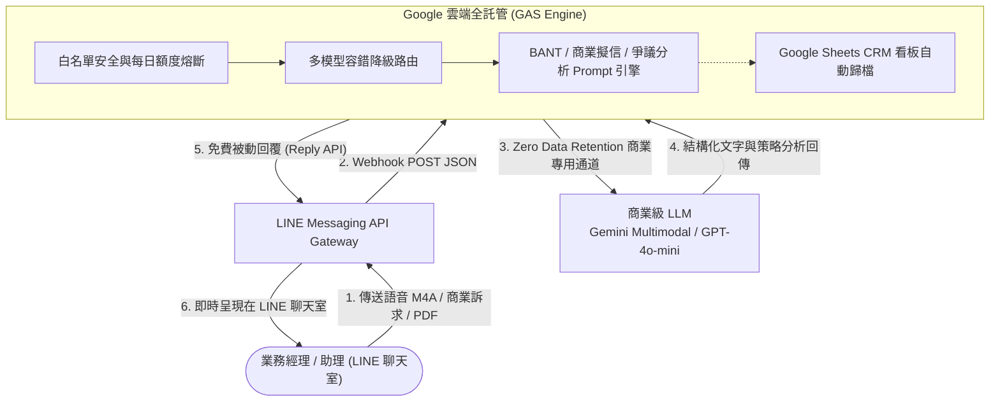

# 💼 企業級 LINE AI 業務助理
### Enterprise LINE AI Sales Assistant (Serverless Sales Copilot)

🌐 **繁體中文 (Traditional Chinese)** | **[English (英文)](./README.en.md)**

 

<!-- Core Tech Stack & Quality Badges -->

 

<!-- Quick Navigation Bar -->
[ 🎯 產品定位 ](#-一-產品定位為什麼選擇-line) •
[ 🚀 四大場景 ](#-二-四大核心實戰業務場景) •
[ 💰 成本分析 ](#-三-極致低成本pay-as-you-go-實報實銷) •
[ 🛠️ 系統架構 ](#️-四-系統架構-system-architecture) •
[ 🔒 資安防護 ](#-五-企業級資安與商業隱私防護) •
[ ⚡ 快速開始 ](#-六-5-分鐘極速開始-quick-start)

---

## 🎯 一、 產品定位：為什麼選擇 LINE？

傳統企業 CRM 或內部系統之所以常被閒置，是因為「打開電腦、登入網頁、適應新介面」的操作摩擦力太高。  
本專案專為 **B2B 第一線外勤業務與內勤助理** 打造，以「**免自建網頁、零學習成本、零伺服器維護費**」為核心：

1. 📱 **零學習門檻**：直接在台灣人天天使用的 LINE 聊天室中對話，無需下載新 App 或登入網頁系統。
2. ⚡ **外勤即時性最高**：拜訪完在計程車上、開車等紅燈時，單手按住錄音 30 秒，AI 立即完成報告整理與信件擬稿。
3. 🛠️ **Serverless 零維護負擔**：基於 Google Apps Script 全託管架構，免伺服器租金、免資料庫維護，永久穩定運行。

---

## 🚀 二、 四大核心實戰業務場景

### 1. ✉️ 全場景「商務回信與談判話術助手」
輸入簡短訴求，AI 在 2 秒內擬出兼具專業度、得體語氣與談判策略的信件與訊息草稿（支援一鍵複製）：
* **拜訪後即時感謝信**：秒級產出確認評估方向與時程的得體訊息。
* **客戶殺價／爭取折扣應對**：採取「堅守價值底線 ＋ 委婉致歉 ＋ 轉向爭取延長保固/增值服務」策略。
* **交期調整／原廠缺料安撫信**：主動說明現況 ＋ 啟動綠色通道 ＋ 明確承諾交付日。

### 2. 🎙️ 語音速記「一鍵轉標準 BANT 決策報告」
業務拜訪完在車上，按住 LINE 錄音 30 秒（支援中英術語混講）：
> 🗣️ **業務口語速記**：  
> *「今天下午拜訪了某某公司採購王經理，他們想為門市更換新版系統，預算大約 150 萬，預計今年 Q4 之前要定案。目前的痛點是舊系統常當機，競品有其他廠商在報價。約好下週三下午 2 點帶工程師去展示 Demo。」*

🤖 **AI 2 秒內自動結構化輸出**：
* 💰 **Budget (預算規模)**：NT$ 1,500,000 元
* 👤 **Authority (決策鏈)**：採購經理王先生（建議後續探詢技術端 Key Man）
* 🎯 **Need (需求痛點)**：舊系統頻繁當機，需於 Q4 前完成新版穩定系統替換
* ⏳ **Timeline (時程規劃)**：下週三 14:00 技術 Demo / Q4 前正式定案
* ⚔️ **競爭態勢與攻防**：強勢競品報價中，我方主打系統高穩定度與在地即時技術支援
* 🚀 **Next Actions (下一步行動)**：下週三前協調工程師準備展示環境

### 3. 📄 商業合約與 PDF 規格書「隨身秒級審閱」
直接在 LINE 聊天室轉傳 20~50 頁的英文/中文規格書、NDA 保密協議或合約，AI 瞬間完成多模態文件解析：
* 🎯 **規格訴求提煉**：3 點萃取客戶最在意的驗收標準與功能清單。
* ⚠️ **商業陷阱與風險排查**：自動標註延遲罰則、履約保證金、無限責任條款。
* 💡 **我方攻防建議**：提供保護公司權益的修改備註建議。

### 4. 📊 業務專屬「Google 試算表 CRM 看板自動同步」
每一次語音或文字速記產出報告後，系統在背景自動寫入 Google 試算表 CRM 看板，主管儀表板即時同步，業務完全免開電腦打字建檔！

---

## 💰 三、 極致低成本：Pay-As-You-Go 實報實銷

本方案打破傳統 SaaS CRM 昂貴的固定月租模式，採用 **Pay-As-You-Go（用多少、付多少）**：

| 評估維度 (Dimension) | 傳統 SaaS CRM / 外部委外 | 本專案解決方案 (Serverless AI Copilot) |
| :--- | :--- | :--- |
| 💰 **軟體授權與主機費** | NT$ 3,000 ~ 15,000 / 月 | **NT$ 0 元**（Google Apps Script 全託管架構） |
| 🤖 **AI 商業運算費** | 包含在昂貴月租中 | **實報實銷**（呼叫一次約 NT$ 0.01~0.03，每人每月約 NT$ 15~30 元） |
| 🔒 **資料隱私保障** | 多租戶共用公有雲資料庫 | **100% 私有隔離**（Zero Data Retention 商業合約保障） |
| 🛡️ **預算熔斷機制** | 需手動監控帳單 | **內建每日次數熔斷 ＋ 雲端預算硬上限 (Hard Cap)** |

---

## 🛠️ 四、 系統架構 (System Architecture)

---

## 🔒 五、 企業級資安與商業隱私防護

1. **商業級零資料保留協議 (Zero Data Retention Guarantee)**：
   * 採用 Google Cloud / OpenAI 商業 API 專用通道，官方承諾：**「傳輸之所有文字、語音、PDF 檔案與運算結果，100% 絕不用於模型訓練與產品改進」**。
2. **無狀態運算 (Zero-Log 零日誌架構)**：
   * 對話在記憶體中瞬時完成轉換並即刻釋放，中繼日誌不留存任何明文客戶個資。
3. **私有化帳號隔離 (Client-Owned Infrastructure)**：
   * 程式直接運行於企業自有的 Google 與 LINE 帳號，交件後外部人員物理隔離。
4. **白名單授權控制 (Whitelist Access Control)**：
   * 內建員工 LINE User ID 白名單過濾，杜絕外部未授權人員調用。

---

## ⚡ 六、 5 分鐘極速開始 (Quick Start)

無需架設任何伺服器，只需以下 4 步即可上線：

1. **建立 Google 試算表**：在 Google Drive 新增一份試算表，點選「擴充功能」➔「Apps Script」。
2. **貼上程式碼**：將 [`gas/Code.gs`](./gas/Code.gs) 內容複製貼入編輯器中並儲存。
3. **設定 API Key**：在「專案設定」➔「指令碼屬性」填入您的 `LINE_CHANNEL_ACCESS_TOKEN` 與 `GEMINI_API_KEY`。
4. **部署 Web 應用程式**：點擊「部署」➔「新的部署」➔「網頁應用程式」，將產生的網址貼回 LINE Developers 的 Webhook URL 即可！

*(詳細圖文說明請參閱 👉 [GAS 5 分鐘部署教學](./gas/README_GAS.md))*

---

## 📄 七、 授權條款 (License)

本專案採用 **[MIT License](./LICENSE)** 授權發布，歡迎自由學習、交流與延伸應用。  
Copyright (c) 2026 Json105. All rights reserved.
